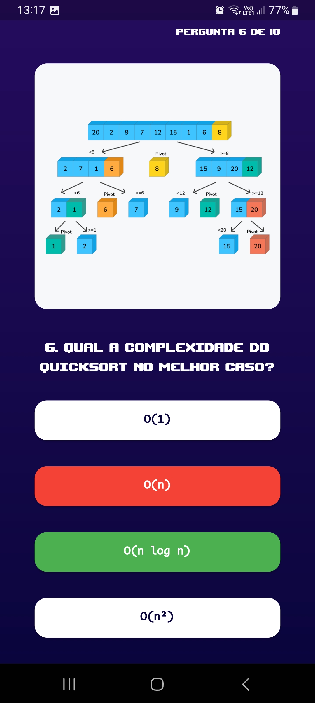
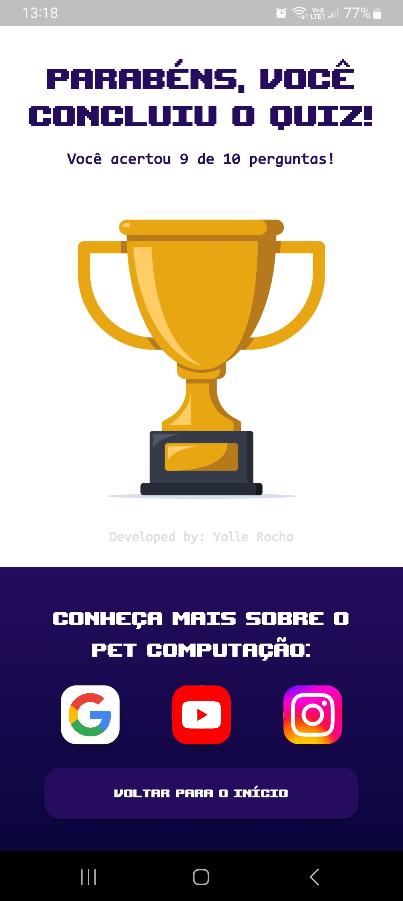

# Quiz PET Computação - Jogo de Perguntas e Respostas 🎓

Bem-vindo ao Quiz PET Computação! Este é um aplicativo educativo de perguntas e respostas sobre computação projetado para divulgar o PET (Programa de Educação Tutorial) de Ciência da Computação da nossa universidade. Este aplicativo é uma ferramenta divertida e interativa para estudantes e entusiastas de computação aprimorarem seus conhecimentos e aprenderem mais sobre o mundo da computação.

## Funcionalidades 🧠

- **Perguntas e Respostas**: Teste seus conhecimentos respondendo a uma variedade de perguntas relacionadas à computação, incluindo programação, hardware, software, sistemas operacionais e muito mais.

## Funcionalidades Futuras 🚀

- **Categorias Temáticas**: Explore várias categorias de perguntas, tornando o aprendizado mais envolvente e abrangente.

- **Modo de Jogo Desafiador**: Enfrente um modo de jogo cronometrado para desafiar suas habilidades de resposta rápida e pontuação mais alta.

- **Divulgação do PET Computação**: O aplicativo inclui informações sobre o PET Computação, seus objetivos e como se envolver, ajudando a aumentar a conscientização sobre o programa.

## Capturas de Tela 📷

## Como Contribuir 🤝

Se você deseja contribuir para este projeto, fique à vontade para fazer um fork do repositório e enviar pull requests com melhorias, correções de bugs ou novas perguntas. Juntos, podemos tornar este aplicativo ainda mais educativo e divertido.

## Requisitos Técnicos 💻

- Dispositivo Android.

## Como Instalar 📲

1. Faça o download do APK e realize a instalação no seu dispositivo Android.

2. Ou, você pode clonar este repositório e compilar o aplicativo por conta própria usando o Android Studio.

## Versão do Aplicativo 📅

Versão 0.1.0 (Beta)

## Contato 📧

- Para relatar problemas ou fazer sugestões, sinta-se à vontade para abrir uma issue neste repositório.

- Para entrar em contato diretamente com a equipe do PET Computação, envie um e-mail para pet@ccc.ufcg.edu.br.

Agradecemos por seu interesse e esperamos que você aproveite o Quiz PET Computação! 🎉
